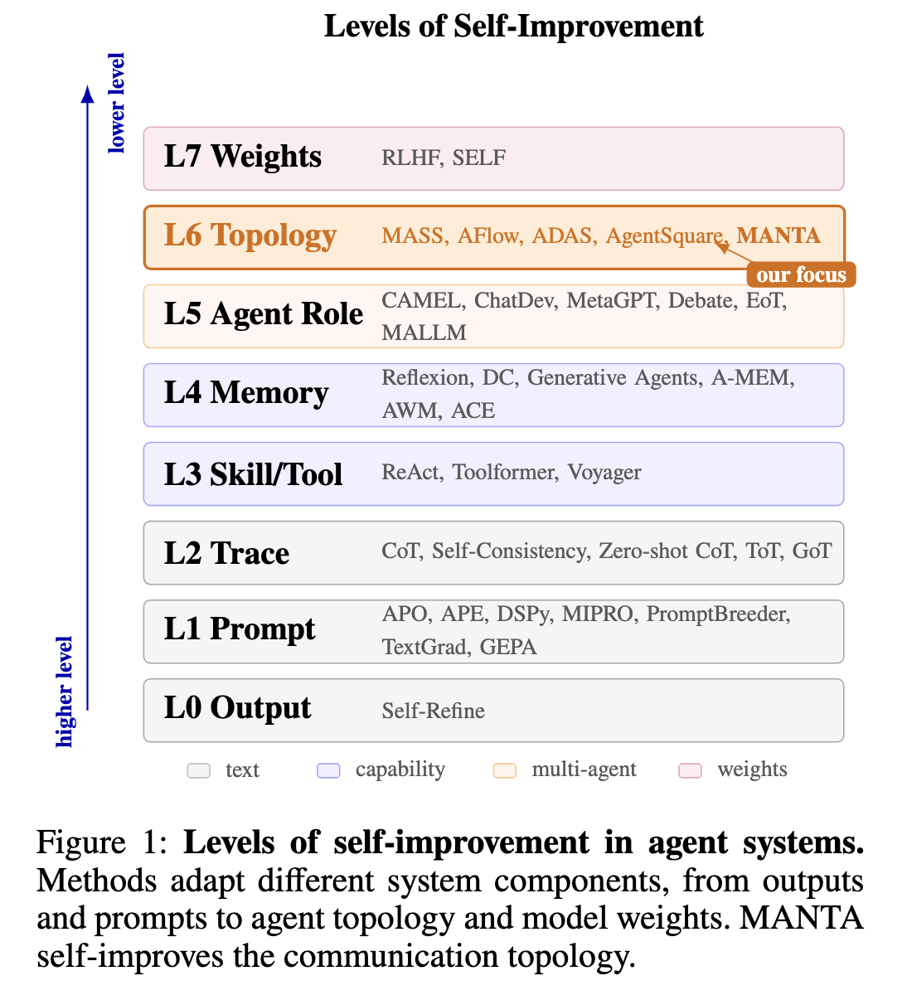
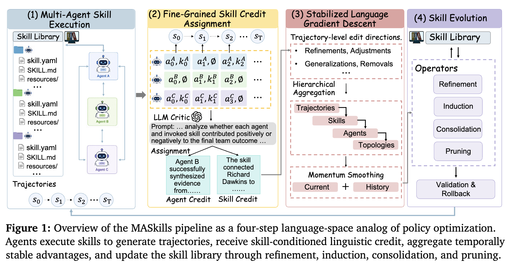
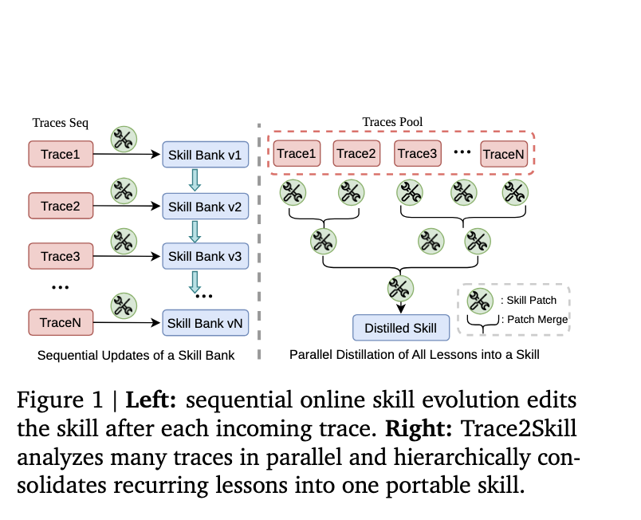
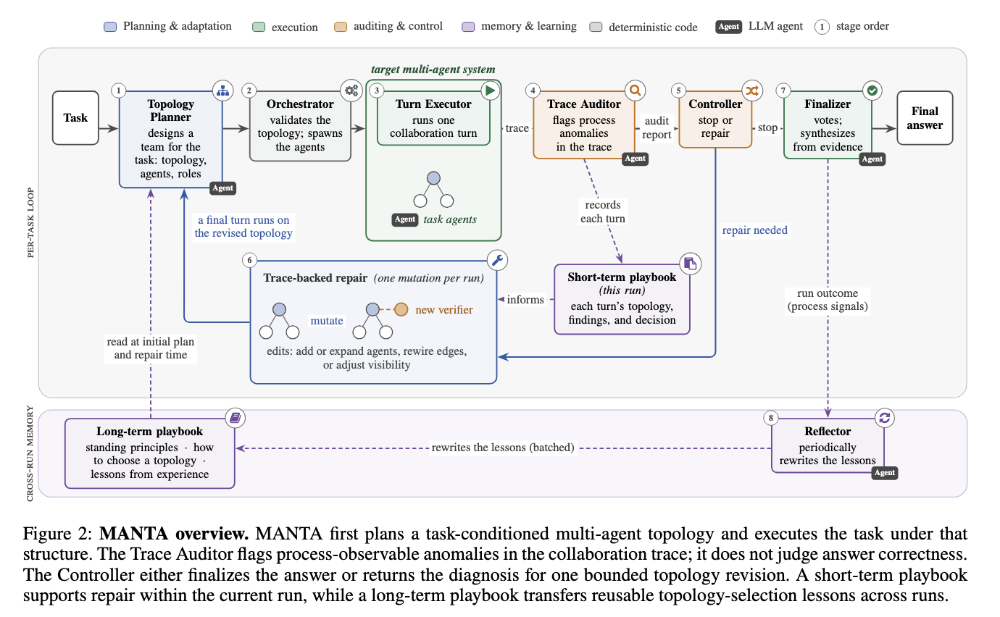
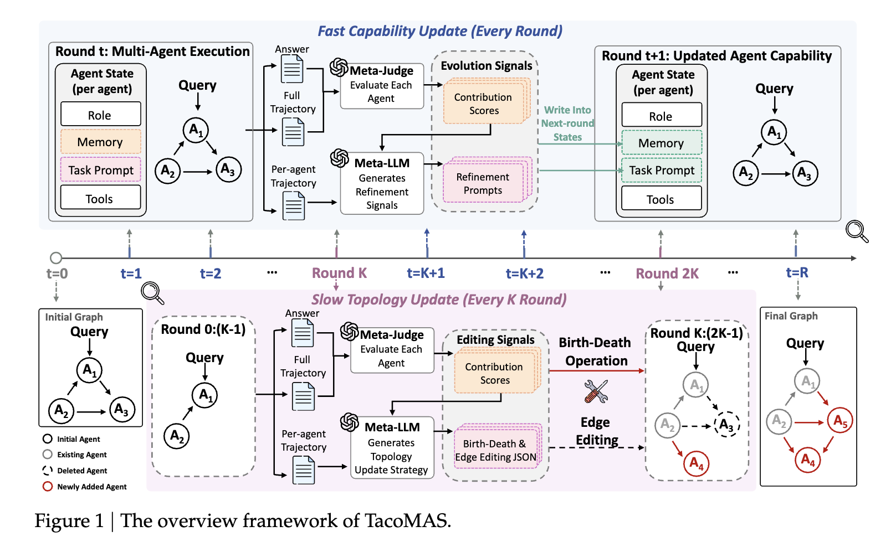
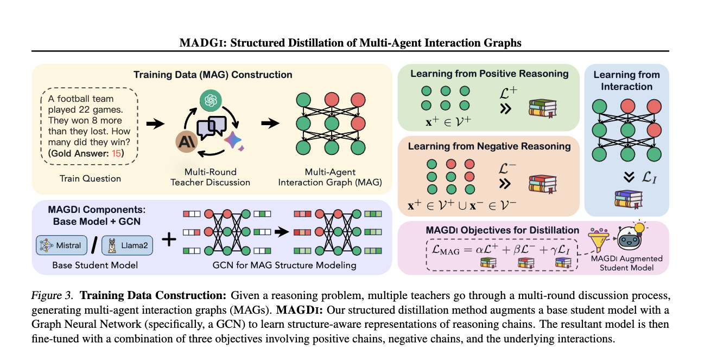
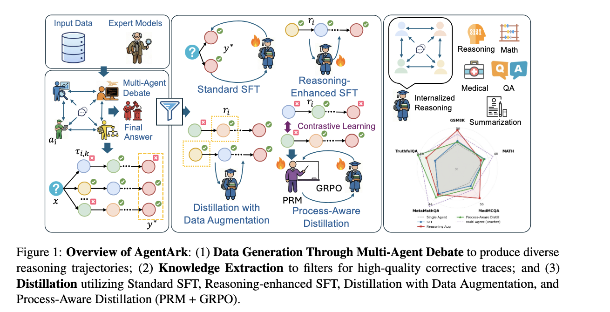
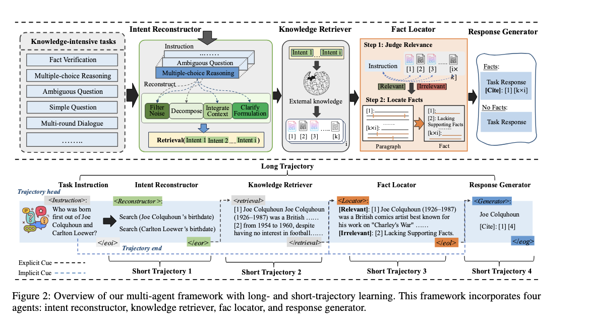
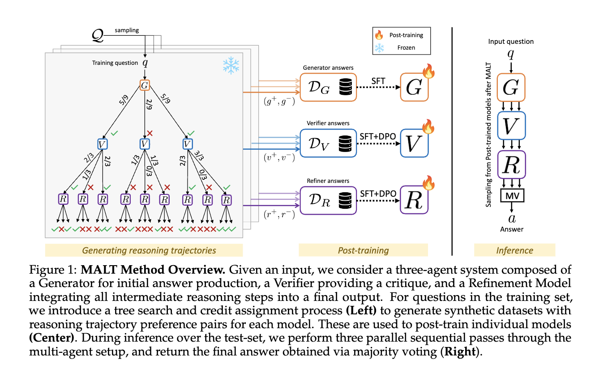

# Traces2MAS调研

## 目录

- [1. 概念辨析](#concepts)
  - [1.1 Agent 系统自进化层级](#self-improvement-levels)
  - [1.2 Harness 层级](#harness-levels)
- [2. Traces2Skill](#traces2skill)
  - [2.1 三篇重点论文简介](#traces2skill-key-papers)
    - [2.1.1 MASkills](#maskills)
    - [2.1.2 Trace2Skill](#trace2skill-paper)
    - [2.1.3 WikiSkill](#wikiskill)
- [3. Traces2Topology](#traces2topology)
  - [3.1 在线](#topology-online)
  - [3.2 离线](#topology-offline)
  - [3.3 重点论文介绍](#traces2topology-key-papers)
    - [3.3.1 MANTA](#manta)
    - [3.3.2 TacoMAS](#tacomas)
- [4. Traces2Weights](#traces2weights)
  - [4.1 蒸馏为单 Agent](#distill-single-agent)
    - [4.1.1 MAGDi](#magdi)
    - [4.1.2 AgentArk](#agentark)
  - [4.2 蒸馏为 Multi-Agent](#distill-multi-agent)
    - [4.2.1 SMART](#smart)
    - [4.2.2 MALT](#malt)

<a id="concepts"></a>
## 1. 概念辨析

<a id="self-improvement-levels"></a>
### 1.1 Agent 系统自进化层级



<a id="harness-levels"></a>
### 1.2 Harness 层级

| 层级 | 主要内容 | 回答的问题 |
|---|---|---|
| Agent Capability | Model、Prompt、Memory、Skill、Tools | 单个 Agent 会做什么 |
| Topology | Agent、角色、分组、通信边、信息可见性 | 团队由谁组成、如何连接 |
| Execution Harness | Orchestrator、调度、消息路由、上下文、状态、工具、Trace | Topology 如何被实际执行 |
| Evolution Harness | Planner、Auditor/Critic、Mutation、Validation、Rollback、Stop | 系统如何根据 Trace 更新并受控终止 |
| External Evaluation | 环境、ground truth、最终指标 | 如何独立判断系统是否真正改进 |


<a id="traces2skill"></a>
## 2. Traces2Skill：从执行轨迹提炼和进化 Agent Skill

| 维度 | Trace2Skill | MemSkill | PolySkill | MASkills | WikiSkill |
|---|---|---|---|---|---|
| 论文链接 | [arXiv:2603.25158](https://arxiv.org/abs/2603.25158) | [arXiv:2602.02474](https://arxiv.org/abs/2602.02474) | [arXiv:2510.15863](https://arxiv.org/abs/2510.15863) | [arXiv:2609.02094](https://arxiv.org/abs/2609.02094) | [arXiv:2608.27454](https://arxiv.org/abs/2608.27454) |
| 开源代码 | [Qwen-Applications/Trace2Skill](https://github.com/Qwen-Applications/Trace2Skill)（官方） | [ViktorAxelsen/MemSkill](https://github.com/ViktorAxelsen/MemSkill)（官方） | [simonucl/PolySkill](https://github.com/simonucl/PolySkill)（官方） | [DaRL-GenAI/MASkills](https://github.com/DaRL-GenAI/MASkills)（官方） | 暂未发现作者官方代码；[ashutoshsinghpr7/wikiskill](https://github.com/ashutoshsinghpr7/wikiskill)（第三方复现） |
| 核心问题 | 如何把大量轨迹中的局部经验归纳成统一、可迁移的 Skill | 如何学习可选择、可进化的记忆管理操作 | 如何设计可跨环境复用和组合的 Skill 表示 | 如何把团队结果归因到具体 agent 和具体 Skill，使多智能体系统持续进化 | 如何把分散在历次优化中的经验持续编译成知识，并用它指导后续 Skill 进化 |
| 被增强对象 | 单个任务执行 agent | agent 的 memory system | Web/GUI agent | cooperative multi-agent system 中的各个 agent | 单个执行 agent 及其长期 Skill 演化过程 |
| 经验来源 | 成功轨迹与失败轨迹 | 全部交互历史，以及反复失败的困难案例 | 经过验证的成功轨迹 | 多 agent 联合交互轨迹和显式 Skill 调用记录 | 原始执行轨迹、评估反馈、历次 Skill 更新结果和累积 wiki |
| 学习单位 | 每条轨迹对应的局部 skill patch | memory skill 与 Top-K skill-selection policy | 抽象 Skill 接口、环境特定实现及其组合 | agent–skill invocation 及其对团队结果的贡献 | 从经验中提炼的持久知识条目，以及由 wiki 指导的 Skill 更新 |
| Skill 形态 | 一个统一的 `SKILL.md + references/scripts/assets` 目录 | 结构化文本 memory-operation bank，描述 purpose、when、how 和 constraints | 程序化多态类层次：抽象接口、具体实现和组合 Skill | 每个 agent 独立维护的 `skill.yaml + SKILL.md + resources` Skill library | 可执行 Skill 与独立的持久 wiki 并存；wiki 保存跨迭代知识，Skill 保存部署时使用的过程性能力 |
| 更新方式 | 先并行提取 trajectory-local patches，再分层去重、消冲突和合并 | 交替训练：RL 优化 Skill selector，LLM Designer 根据 hard cases 修改或新增 Skill | 从成功轨迹在线归纳；先建立抽象接口，再补充站点特定实现并组合 | centralized critic 分配语言 credit，经分层聚合和 momentum smoothing 后执行 refinement、induction、consolidation、pruning | Wiki Maintainer 持续把新经验合并进 wiki；Skill Proposer 读取当前 Skill、wiki 和新结果，提出后续更新，二者共同演化 |
| 主要归因 | 某条成功或失败轨迹揭示了什么可复用规律 | 哪组 memory skills 能提高下游问答或行动奖励 | 成功行为中的哪些步骤可抽象为稳定接口和可替换实现 | 哪个 agent 的哪个 Skill 对团队成功、失败、冗余或协调产生贡献 | 当前结果揭示了什么新知识，以及该知识是否应该修改可执行 Skill；重点是跨迭代知识积累而非一次性归因 |
| 防退化机制 | 多轨迹一致性、冲突消解、偶然 patch 过滤、diff guardrails 和格式验证 | best-snapshot rollback、early stopping、hard-case 聚类和新 Skill 探索 | 使用新 Skill 重放原任务，只有再次成功才写入 Skill library | held-out validation、rollback、momentum smoothing、Skill consolidation 和 pruning | 保留独立持久 wiki，使被拒绝或未写入 Skill 的经验仍可供以后使用；通过评估反馈控制后续 Skill 更新 |
| 主要迁移目标 | 跨模型规模、模型家族和 OOD 任务 | 跨记忆任务、对话与具身交互场景 | 跨任务、网站和领域 | 跨任务、LLM backbone 和 coordination topology | 跨模型规模、模型家族和 Skill author/user 组合；支持长期累积而不因回滚丢失经验 |
| 是否需要参数训练 | 否 | 是；训练 Skill selector/controller，但执行 LLM 可保持冻结 | 通常不更新基础 LLM | 不更新基础 LLM；在语言 Skill 空间进行优化 | 否；主要更新外部 wiki 和 Skill artifact |
| 最大特色 | 全局、并行的轨迹归纳与 consolidation | Skill selection 与 Skill evolution 联合学习 | 将 Skill 的抽象目标与具体实现解耦 | 多智能体、细粒度 Skill credit assignment | 在 raw experience 与 executable Skill 之间增加持久知识层，避免优化历史和失败经验随 Skill 回滚而丢失 |

<a id="traces2skill-key-papers"></a>
### 2.1 Traces2Skill 三篇重点论文简介

<a id="maskills"></a>
#### 2.1.1 MASkills：多智能体轨迹中的 Skill Credit Assignment

- 论文：[MASkills: Continual Skills Optimization for Multi-Agent LLM Systems](https://arxiv.org/abs/2609.02094)
- 代码：[DaRL-GenAI/MASkills](https://github.com/DaRL-GenAI/MASkills)



*图：MASkills 论文 Figure 1。它把整个方法概括成语言空间中的四步策略优化循环。*

MASkills 研究如何让真正的 cooperative multi-agent system 从联合交互经验中持续改进。每个 agent 都维护自己的结构化 Skill library；执行时，系统不仅记录各 agent 的动作，还显式记录每一步调用了哪个 Skill。中央 critic 阅读完整团队轨迹，把最终团队结果归因到具体的 agent–Skill invocation，并生成自然语言 credit，说明该 Skill 是促进了协作、造成了失败、产生了冗余，还是需要泛化或收窄适用范围。

来自不同轨迹的反馈会被整理成较稳定的语言更新方向。系统随后对 Skill library 执行 refinement、induction、consolidation 和 pruning，并使用 held-out validation 与 rollback 防止退化。

##### 2.1.1.1 “Hierarchical Aggregation”到底在聚合什么

这里的 **hierarchical aggregation 是信用与更新建议的分层汇总机制，不是层级式 Agent 拓扑，也不表示系统会学习或修改通信拓扑**。论文图中的 `Trajectories → Skills → Agents → Topologies` 应理解为由细到粗地组织证据：

1. **Trajectory 层。** 中央 critic 针对一条联合轨迹，评价其中实际发生的每个 `(agent, skill)` 调用，输出该 Skill 对团队结果是 `helped`、`redundant`、`harmful` 还是 `neutral`，并附上证据、修改建议和 utility delta。
2. **Skill 层。** 对固定的 `agent i + skill_id k`，合并它在多条轨迹中的 credit。例如同一个 Retriever 的 `cross-check-source` Skill 可能在一条轨迹中有效、在另一条轨迹中导致重复检索；聚合器需要去重、处理矛盾并形成一个稳定的 `SkillGradient G_i(k)`。
3. **Agent 层。** 将该 Agent 名下各个 Skill 的梯度、调用次数、utility 和 residual failure 放回同一个 `K_i` 中处理，由此决定修改哪个 Skill、合并哪些 Skill、删除低效 Skill，或者为这个 Agent 归纳一个新 Skill。这里的“Agent 层”仍然是在组织和更新个人 Skill Library，并不是修改 Agent 的模型、数量或连接关系。
4. **Topology 层。** 在论文的完整概念中，拓扑可以作为产生轨迹的上下文或分组维度，用于观察同一个 Agent–Skill 规律在 centralized、decentralized 等协作条件下是否稳定。即使发现某个 Skill 只在特定拓扑中有效，典型输出仍是修改 Skill 的触发条件或协作规则，而不是把一种拓扑自动改造成另一种拓扑。

因此，最核心的聚合单位可以写成：

```text
固定的 agent identity + 固定的 skill_id
    ├── trajectory 1 中的 credit
    ├── trajectory 2 中的 credit
    ├── trajectory 3 中的 credit
    └── ……
              ↓ 聚合
       该 Agent 的该 Skill 的更新方向 G_i(k)
```

如果轨迹来自不同拓扑，还必须满足身份可对齐：不同拓扑里的 Agent 应承担相同或可比较的角色，Skill 也应保持同一个稳定 `skill_id`。两个 Agent 即使拥有同名 Skill，也不会自动被当作同一更新对象；反过来，如果同一个 `agent` 标签在不同拓扑中代表完全不同的职责，也不应直接合并其 credit。


##### 2.1.1.2 与 Trace2MultiAgent 的关系

MASkills 与 Trace2MultiAgent 最接近，因为它已经实现了“多智能体联合轨迹 → `(agent, skill)` 级细粒度贡献归因 → 每个 Agent 的 Skill Library 更新”。不过，MASkills 的主要优化对象仍是各 Agent 的个人 `K_i`：当前代码可以通过默认关闭的 `evolve_role` 开关保守修改角色提示词，但不会自动增删 Agent、重新分配模型、增加或删除通信边，也不会从轨迹中搜索新的协作拓扑。

因此，Trace2MultiAgent 可以进一步把学习对象从“各 Agent 怎样做”扩展到“团队怎样组织和协作”：从多智能体轨迹中提炼独立的 team-level coordination skill，显式描述动态分工、任务委派、消息压缩、证据交接、冲突解决、结果聚合、验证与停止规则；更进一步，还可以把角色集合与通信拓扑本身纳入候选生成和验证循环。


<a id="trace2skill-paper"></a>
#### 2.1.2 Trace2Skill：从轨迹局部经验归纳可迁移 Skill

- 论文：[Trace2Skill: Distill Trajectory-Local Lessons into Transferable Agent Skills](https://arxiv.org/abs/2603.25158)
- 代码：[Qwen-Applications/Trace2Skill](https://github.com/Qwen-Applications/Trace2Skill)



*图：传统顺序更新会让每条新轨迹依次改写 Skill Bank；Trace2Skill 则先从所有轨迹独立提取 Skill Patch，再通过层级合并得到统一的 Distilled Skill。*

Trace2Skill 关注如何避免根据单条轨迹顺序修改 Skill 所造成的顺序依赖、规则碎片化和局部过拟合。它首先让固定 agent 在一组任务上执行，收集带有推理、工具调用、环境反馈和正确性标签的成功与失败轨迹。随后，多个 analyst 并行分析每条轨迹：success analyst 提取有效行为，error analyst 检查日志、产物和 ground truth，并验证失败根因和候选修复。

每条轨迹先形成一个局部 skill patch，之后系统通过 hierarchical consolidation 去重、解决冲突、保留反复出现的规律并过滤偶然经验，最终得到一个统一的 `SKILL.md + references/scripts/assets` Skill directory。该 Skill 可以直接在推理阶段使用，无需模型参数更新或检索原始轨迹。

Trace2Skill 对 Trace2MultiAgent 的主要启发是“先保留局部 lesson，再进行全局归纳”。扩展到团队场景时，可以把普通执行轨迹替换成包含 spawn、delegate、message、handoff、aggregate 和 stop 等事件的协作轨迹，再把 trajectory-local patch 扩展成 coordination-protocol patch。

<a id="wikiskill"></a>
#### 2.1.3 WikiSkill：在原始轨迹与可执行 Skill 之间加入持久知识层

- 论文：[WikiSkill: Compiling Agent Experience into Persistent Knowledge for Skill Evolution](https://arxiv.org/abs/2608.27454)
- 代码：暂未发现作者官方仓库；可参考第三方复现 [ashutoshsinghpr7/wikiskill](https://github.com/ashutoshsinghpr7/wikiskill)

WikiSkill 解决的问题是：很多 Skill evolution 方法虽然不断分析新轨迹，但分析结论散落在 proposal、日志和被拒绝的修改中；一旦 Skill 更新被回滚，其中有价值的经验也可能无法被后续迭代系统利用。它因此把工作区分为三个层次：保存不可变执行记录的 Raw Layer、持续累积结构化规律和演化历史的 Wiki Layer，以及保存当前可执行过程性知识的 Skill Layer。

每轮中，Inference Agent 使用当前 Skills 生成轨迹；Wiki Maintainer 从成功和失败轨迹中提炼根因、策略和 workaround，并更新永久保留的 wiki；Skill Proposer 阅读 wiki、当前 Skills 和最新轨迹，提出一次原子化 Skill 修改；最后通过 validation gating 决定接受还是回滚 Skill。无论 Skill 修改是否被接受，wiki 都不会回滚，因此系统能够记住失败的修改、反复出现的问题以及已经验证过的规律。

WikiSkill 类似于在线不断迭代的结构，Trace2Skill 类似于离线迭代。


<a id="traces2topology"></a>
## 3. Traces2Topology：从协作轨迹改进或生成 Multi-Agent Topology

<a id="topology-online"></a>
### 3.1 在线

| 维度 | MANTA | TacoMAS |
|---|---|---|
| 论文链接 | [arXiv:2607.28527](https://arxiv.org/abs/2607.28527) | [arXiv:2605.09539](https://arxiv.org/abs/2605.09539) |
| 开源代码 | [mao-code/MANTA](https://github.com/mao-code/MANTA)（官方） | [chenxu2-gif/TacoMAS-MultiAgent](https://github.com/chenxu2-gif/TacoMAS-MultiAgent)（官方） |
| 与严格 `Traces2Topology` 的关系 | **直接、在线、单条为主**：审计当前正在增长的协作 Trace 并修复当前图；跨运行 playbook 提供结构先验。主要是 online trace-to-topology repair，并辅以 cross-run trace-to-topology-playbook distillation。 | **直接、在线、同任务多条**：单轮 Trace 快速改能力，连续 `K` 轮 Trace 的聚合表现慢速改图 |
| 核心问题 | 能否在任务执行时发现当前协作结构失效，并进行有界修复 | 让多智能体系统在处理每个任务时，同时调整“每个智能体会做什么”和“智能体之间如何协作”，而不是事先固定团队结构 |
| 被增强对象 | 当前任务的 `TopologySpec` 与跨运行 topology playbook | 当前任务的 Agent capability state 与有向 Agent graph |
| 经验来源 | 当前 live collaboration trace、Trace Auditor 的 grounded flags、共识质量，以及历次运行的结构化总结 | 同一 query 的连续执行轮次；每轮包含各 Agent 的推理、工具结果、消息和贡献分数 |
| Trace 粒度 | 一条任务内持续增长的 Trace；长期层使用多次运行的摘要，而非一次性批量合并全部原始 Trace | `xi_t` 是一轮完整团队 Trace；Topology 更新读取最近 `K` 轮 `xi_{t-K+1:t}` |
| Topology 形态 | Agent角色、边连接、分组 | Agent角色，边连接 |
| 主要迁移目标 | 让跨运行的拓扑选择和修复经验迁移到新任务，同时保持当前任务内适应 | 每个任务实例结束后会清空这次积累的临时记忆，因此不会把一次任务中学到的内容保留下来，用于更新后续任务。 |
| 是否需要参数训练 | 否 | 否 |
| 最大特色 | 在固定 Harness 内对当前协作图做可追踪、可回放的实时结构修复 | 明确实现“**单条 Trace 快速更新能力 + 多轮 Traces 慢速更新 Topology**” |

<a id="topology-offline"></a>
### 3.2 离线
EMAS: STABILIZING MULTI-AGENT SYSTEM EVOLU-TION THROUGH EVIDENCE-GUIDED REVISION等
当前多智能体系统处理一批新任务，留下执行轨迹和准确率、token 成本等反馈。EMAS 据此诊断问题、提出一个候选修改，再把候选系统和当前系统放到同一验证集上比较。符合目标就接受修改，进入新版本；否则保留当前版本。接受的修改会成为后续任务继续使用的系统状态

<a id="traces2topology-key-papers"></a>
### 3.3 Traces2Topology 重点论文介绍

<a id="manta"></a>
#### 3.3.1 MANTA：在任务执行过程中审计 Trace，并有界修复协作拓扑

- 论文：[MANTA: Multi-Agent Network Topology Adaptation for Self-Evolving Multi-Agent Systems](https://arxiv.org/abs/2607.28527)
- 代码：[mao-code/MANTA](https://github.com/mao-code/MANTA)



*图：MANTA 总体流程。上半部分是单个任务内部的 `Plan → Execute → Audit → Repair/Stop` 循环；下半部分把多次运行的过程信号批量反思为长期 topology playbook。*

MANTA 不是离线搜索一张固定图，也不是用大量原始 Trace 训练 topology generator，而是在两个时间尺度上更新拓扑：当前任务内根据正在增长的 Trace 修复当前图；跨任务则把多次运行的过程摘要写入长期 playbook，影响后续任务的初始图和 repair。

```text
当前任务 + Long-term Playbook → 初始 TopologySpec G₀
                              → 执行产生 Trace τₜ
                              → Auditor 提取异常 fₜ
                              → Stop，或应用 ΔGₜ 得到 Gₜ₊₁

多次运行的过程摘要 → Reflector → 更新 Long-term Playbook
                              → 指导后续任务的初始图与 Repair
```
##### 3.3.1.1 图中 1–8 阶段

1. **Topology Planner：生成初始团队。** Planner 读取当前任务和 long-term playbook，分析任务类型、是否适合并行、是否需要辩论或验证、是否包含有副作用的写操作，以及可能出现的协作失败。输出是结构化 `TopologySpec`，描述 Agent/group、协作模式、通信关系、上下文可见性和验证位置，而不是一段不可执行的自然语言建议。

2. **Orchestrator：验证并实例化拓扑。** 这一部分是确定性代码。它检查 `TopologySpec` 是否满足 Agent 数量、预算和结构约束，将其投影成真实执行图，为 Agent 分配结构角色和 context policy，并初始化共享状态。Planner 决定图的形状；代码负责把形状安全地变成可执行系统。

3. **Turn Executor：按当前图执行一轮。** Executor 依照图结构运行 `singleton`、`star`、`chain`、`debate` 或 `voting` group。各 Agent 的消息、工具调用、产物、证据和中间决定被写入同一条结构化 Trace。若后面发生拓扑修改，这些状态不会被清空。

4. **Trace Auditor：检查协作过程，而不是判断答案对错。** Auditor 读取当前轮的 artifacts、messages 和 tool records，寻找可从过程直接观察到的异常，例如工具错误级联、多个分支退化成相同思路、证据在聚合前丢失、过早共识、缺少 verifier、搜索覆盖不足、重复执行有副作用的写操作等。默认 hybrid 模式同时使用确定性检测和开放式 LLM observer，但开放式发现只有在给出可核验的 Trace 引用、通过 schema/confidence 检查且能够通过结构修改修复时，才可以消耗 repair budget。

5. **Controller：确定性地决定 stop 还是 repair。** 只有同时满足“审计建议修复、仍有 mutation budget、仍有剩余 turn”时，Controller 才允许继续。Agent 不负责决定循环是否终止，避免它为了继续思考而无限扩张团队或反复重试。

6. **Trace-backed Repair：每轮最多应用一个结构修改。** Planner 同时读取 auditor diagnosis、当前任务内的 short-term playbook 和跨任务 long-term playbook，提出一个 `TopologyMutation`。允许的操作包括增加 Agent、把单个 Agent 扩展成 group、改变 group pattern、增加或删除通信边，以及调整 context policy。Agent 集合是 **add-only** 的：可以增加，但不能删除；总体数量受 `max_total_agents` 限制。修改完成后，新图再运行一轮。

7. **Finalizer：跨轮保留候选并形成最终答案。** MANTA 不会让后一次 repair 自动覆盖前一轮可能更好的结果。Finalizer 保存每一轮的 aggregate candidate，通过投票或 judge 选择；若候选较弱、存在未解决问题或证据不足，再由 synthesizer 基于现有证据重组答案。

8. **Reflector：把多次运行的经验写入长期 Playbook。** 每次运行结束只产生 process-only update candidate。系统累积一个 batch 后，Reflector 才重写长期 `topology_skill.md` 中的经验部分；后续任务的 Planner 会重新加载它，用于初始规划和任务内 repair。默认代码配置是每 12 次运行触发一次在线反思，也可以在实验结束后离线反思。

<a id="tacomas"></a>
#### 3.3.2 TacoMAS：同一 Query 内用多轮推理轨迹在线共进化 Capability 与 Topology

- 论文：[TacoMAS: Test-Time Co-Evolution of Topology and Capability in LLM-based Multi-Agent Systems](https://arxiv.org/abs/2605.09539)
- 代码：[chenxu2-gif/TacoMAS-MultiAgent](https://github.com/chenxu2-gif/TacoMAS-MultiAgent)



（最大问题是judge的LLM是要详细的评价标准的，某种程度上需要ground truth）

TacoMAS 也是**在线改进**，系统不是先在训练集上汇总大量轨迹、离线学好一张图再部署，而是在回答当前 query 的过程中反复执行、评价和修改。给定同一个 query `q`，第 `t` 轮使用当前系统 `G_t` 完成一次完整的 multi-agent rollout，产生一条团队 Trace `xi_t`；随后更新状态，并用更新后的系统重新推理同一个 query。

a.快时间尺度：更新agent本身
1. **Meta-Judge 读取完整团队 Trace。** 它评价每个 Agent 对最终结果的贡献，生成 contribution score 及文字理由。使用 full trajectory 是为了在团队上下文中归因，而不是只看某个 Agent 的局部输出。
2. **Meta-LLM 读取单 Agent Trace 与归因结果。** 它诊断该 Agent 的具体错误，生成下一轮 refinement prompt 或执行计划。
3. 将信号写回下一轮 Agent state。

b.慢时间尺度：更新topology

Topology 不随每一条 Trace 立即改变，而是先让 capability 在相对固定的结构中连续适应。每经过 `K` 轮，如果当前答案分数仍低于成功阈值，Meta-LLM 才审查最近阶段的多轮轨迹、各 Agent 的贡献历史和 capability 变化，提出受预算约束的结构增量 `Delta T`：


<a id="traces2weights"></a>
## 4. Traces2Weights：从多智能体轨迹学习模型参数

<a id="distill-single-agent"></a>
### 4.1 蒸馏为单 Agent

这类方法在训练阶段运行 Multi-Agent System 收集协作轨迹，随后把团队的推理、辩论、纠错或工具使用能力压缩进一个模型；部署时不再运行原来的完整 MAS。

| 维度 | MAGDi | AgentArk | Chain-of-Agents | ProductResearch |
|---|---|---|---|---|
| 论文链接 | [arXiv:2402.01620](https://arxiv.org/abs/2402.01620) | [arXiv:2602.03955](https://arxiv.org/abs/2602.03955) | [arXiv:2508.13167](https://arxiv.org/abs/2508.13167) | [arXiv:2602.23716](https://arxiv.org/abs/2602.23716) |
| 开源代码 | [dinobby/MAGDi](https://github.com/dinobby/MAGDi)（官方） | [AIFrontierLab/AgentArk](https://github.com/AIFrontierLab/AgentArk)（官方） | [OPPO-PersonalAI/Agent_Foundation_Models](https://github.com/OPPO-PersonalAI/Agent_Foundation_Models)（官方） | 暂未发现作者官方代码 |
| Multi-Agent 轨迹来源 | 多个 LLM Agent 多轮交互形成的 reasoning interaction graph | 多 Agent debate、critique、revision 与 consensus 轨迹 | 现有 Multi-Agent Framework 产生的多角色、多工具、长程执行轨迹 | User Agent、Supervisor Agent 与 Research Agent 协作生成的电商调研轨迹 |
| 被训练对象 | 较小的 student LM，并加入 graph encoder | 单个目标 LLM | 单个 Agent Foundation Model | 单个紧凑 MoE Agent |
| 训练方式 | next-token prediction + 正误推理对比损失 + graph objective | reasoning-enhanced SFT、trajectory augmentation、process-aware distillation | multi-agent trajectory SFT + 可验证任务上的 agentic RL | 轨迹过滤、反思式 internalization 与 fine-tuning |
| 被内化的协作信息 | 正确与错误推理、Agent 间影响关系和交互图结构 | debate 中的多样推理、批判、自我纠错和修订过程 | 角色切换、工具调用、长程任务分解与多 Agent 工作流 | 用户意图、监督反馈、研究过程和报告生成经验 |
| 推理时形态 | 单个 student model | 单 Agent、单次或低轮次推理 | 一个模型在内部动态激活逻辑上的 role/tool agents | 单个电商 Deep Research Agent |
| 是否保留原 MAS | 否 | 否 | 不保留原外部 MAS；在一个模型内部模拟 Chain-of-Agents | 否 |
| 核心目标 | 将昂贵的多 Agent reasoning graph 压缩到小模型 | 把显式 MAS debate 变成单模型的隐式推理和纠错能力 | 将复杂 Agent Framework 内化为可训练的端到端 Agent Foundation Model | 用多 Agent 合成监督数据训练领域 Agent |

<a id="magdi"></a>
#### 4.1.1 MAGDi：把多智能体讨论图蒸馏到小模型

- 论文：[MAGDi: Structured Distillation of Multi-Agent Interaction Graphs Improves Reasoning in Smaller Language Models](https://arxiv.org/abs/2402.01620)
- 代码：[dinobby/MAGDi](https://github.com/dinobby/MAGDi)



*图：GCN和student联合训练，一个辅助监督模块，GCN梯度可以反向更新student参数*

MAGDi 的目标是把昂贵的多模型、多轮讨论压缩成一个可独立推理的小模型。蒸馏对象是完整的多智能体交互图，而不只是最终共识。

```text
问题 x
  → GPT-4、Bard、Claude 2 等 Teacher 多轮讨论
  → Multi-Agent Interaction Graph（MAG）
  → 正确/错误推理 + Agent 间依赖关系
  → Base Student LM + GCN
  → 可独立推理的 Student Model
```

在 MAG 中，每个节点是一名 Agent 在某一轮生成的推理，并依据最终答案是否正确标为正节点或负节点；有向边表示当前推理读取或回应了哪些上一轮输出。因此，MAG 同时保留了“说了什么”和“信息如何在 Agent 之间流动”。

训练时，MAGDi 联合使用三类目标：

1. **从正确推理学习**：用语言建模目标模仿多位 Teacher 的正确 reasoning chains。
2. **从错误推理学习**：通过正负推理的对比信号，使正确链得分高于错误链；错误轨迹在这里是负样本，而不是要求 Student 模仿的目标。
3. **从交互结构学习**：GCN 编码 MAG 的节点与边，使 Student 利用多轮讨论中的回应、影响和修正关系，而非把所有回答当成互不相关的文本。


<a id="agentark"></a>
#### 4.1.2 AgentArk：以推理过程为中心的 Multi-Agent Distillation

- 论文：[AgentArk: Distilling Multi-Agent Intelligence into a Single LLM Agent](https://arxiv.org/abs/2602.03955)
- 代码：[AIFrontierLab/AgentArk](https://github.com/AIFrontierLab/AgentArk)



*图：AgentArk 先通过 Multi-Agent Debate 生成包含分歧、批判和纠错的 Teacher 轨迹，再经过 correctness-first filtering 提取有效推理，最后用不同强度的监督将其写入单个 Student Model。图中的 Standard SFT 是只学习最终答案的对照；RSFT、Data Augmentation 和 PAD 是三种推理蒸馏路线，而不是依次执行的三个必经阶段。*

AgentArk 不是把 Agent 角色、通信拓扑或 Debate Harness 原样复制给 Student，而是把 MAS 最有价值的 **reasoning dynamics**——提出不同假设、发现他人错误、根据批评修改推理和最终收敛——内化到单模型参数中。其核心映射是：

```text
Multi-Agent Debate Logs
    → 正确且包含纠错价值的 Teacher Reasoning Traces
    → Reasoning-level Supervision
    → 单个 Student Model 的 Weights
```

##### 4.1.2.1 Teacher 轨迹如何生成

对每个带有正确答案 `y*` 的输入问题 `x`，系统默认启动 **5 个 Debate Agents**，另有一个最终答案 summarizer。5 个 Agent 使用相同的 Teacher LLM，但各自拥有独立生成上下文，最多进行 **3 轮**辩论：

1. **第一轮独立求解。** 每个 Agent 独立生成推理轨迹和最终答案，形成多条不同的初始解法。
2. **后续轮读取同伴轨迹。** 第 `k` 轮的 Agent `a_i` 会看到其他 Agent 在第 `k-1` 轮的推理，检查逻辑冲突、遗漏和替代路径，再修订自己的解法。
3. **达到轮数或共识后停止。** 系统保存所有 Agent、所有轮次的完整 Debate Log，而不是只保存最终共识答案。

```text
τᵢ,₁ = Teacher Agent i 独立回答(x)

τᵢ,ₖ = Teacher Agent i 回答(x, 其他 Agent 的 τⱼ,ₖ₋₁)

Lₓ = {τᵢ,ₖ | i = 1…5, k = 1…3}
```

因此 Teacher 数据不仅包含“最后如何答对”，还包含三种关键过程信号：多个独立起点、Agent 间的交叉检查，以及某条轨迹从错误判断转向正确答案的 corrective transition。

##### 4.1.2.2 如何筛选可蒸馏的 Teacher 轨迹

原始 Debate Log 中既有正确推理，也有错误、附和和噪声，不能全部直接监督 Student。AgentArk 采用 correctness-first extraction：

1. **先检查最终答案。** 自动 verifier `Qwen2.5-72B-Instruct` 只比较候选答案与 ground truth 是否一致；此时不评价推理文本。
2. **保留 successful contributors。** 只有最终答案被验证正确的 Agent 才进入候选集合。用于多轨迹增强时，如果同一道题不足两条正确轨迹，该样本会被排除，因为无法提供可靠的解法多样性。
3. **优先保留 corrective traces。** 重点不是始终正确的平滑轨迹，而是 Agent 先出现错误，读到同伴批评后成功修正并到达 `y*` 的轨迹。这类数据显式展示了错误发现与自我修正。
4. **在正确前提下选择多样性。** 辅助 Judge 读取问题、ground truth 和多条正确轨迹，从中选择 `1–3` 条结构不同的解法，例如采用不同的分解顺序、中间表示或推理起点。Judge 在这里评估的是差异性，不再重新决定答案是否正确。

经过 Multi-Agent generation、正确性过滤和多样性选择后，论文最终得到约 **34.2 万个问题、200 万条 reasoning trajectories**。这一步决定了 Student 学到的是“多个可靠推理路径”，而不是对完整聊天记录进行无差别模仿。

##### 4.1.2.3 如何蒸馏到 Student Model

AgentArk 比较了由浅到深的四种监督。其中 Standard SFT 是对照，其余三种是主要的 reasoning-centric distillation 方法。

**Standard SFT：只学习答案。**

```text
(x → y*) → Student
```

它忽略 Debate 中的推理过程，容易学到任务表面的输入—答案映射，因此主要用于说明“只有正确答案并不足以稳定迁移 MAS reasoning”。

**Reasoning-Enhanced SFT（RSFT）：模仿正确推理和答案。**

```text
(x → successful reasoning trace r → y*) → Student
```

训练目标同时覆盖 reasoning tokens 和 final-answer tokens，使 Student 学会生成完整、连贯的中间推理，而不只是复现结果。

**Distillation with Data Augmentation（DA）：学习同题多条正确路径。**

```text
x → {r₁, r₂, r₃} → 同一个 y*
```

Student 在同一问题的多条正确且结构不同的推理上进行训练，从而吸收 MAS 的多视角探索能力，避免只记住一种固定解题模板。

**Process-Aware Distillation（PAD）：使用 PRM + GRPO 学习纠错过程。**

PAD 不要求 Student 逐字模仿 Teacher，而是先把 Debate 中“哪些中间步骤更好”训练成奖励模型，再用该奖励优化 Student：

1. **训练 Process Reward Model。** PRM 从 Student 权重初始化；先冻结主体，只训练最终层和 reward head，使其学会映射 step-level correctness，之后再解冻全模型进行专门化。PRM 使用对比目标，让一致、正确的推理步骤得分高于矛盾或错误步骤。
2. **固定 PRM，训练 Student Policy。** Student 对同一输入采样一组候选推理；PRM 对这些候选的中间步骤进行评分。
3. **使用 GRPO 更新 Student。** 系统根据组内相对奖励计算 advantage，在提高高质量推理概率的同时使用 KL penalty 防止策略偏离参考模型过远。

```text
Debate 中的正/负 reasoning steps
        → 训练 PRM

Student 为 x 生成一组候选 reasoning outputs
        → PRM 提供过程分数
        → GRPO 更新 Student Weights
```


<a id="distill-multi-agent"></a>
### 4.2 蒸馏为 Multi-Agent

这类方法同样把轨迹写入模型权重，但训练后的角色仍在固定 Multi-Agent 流程中协作。这里的“Multi-Agent”指部署时保留显式角色和阶段，不要求每个角色一定使用完全不同的基础模型。

| 维度 | SMART | MALT |
|---|---|---|
| 论文链接 | [arXiv:2407.09893](https://arxiv.org/abs/2407.09893) | [arXiv:2412.01928](https://arxiv.org/abs/2412.01928) |
| 开源代码 | [yueshengbin/SMART](https://github.com/yueshengbin/SMART)（官方） | 暂未发现作者官方代码 |
| Multi-Agent 轨迹来源 | 12 类知识密集型任务构造的 short-trajectory 与 long-trajectory 数据 | Generator、Verifier、Refiner 反复采样形成的 multi-agent search tree |
| 被训练对象 | 由特殊 trajectory tokens 区分角色的共享 LLM；外部 Retriever 保持独立 | Generator、Verifier、Refiner 三个 role-conditioned models |
| 训练方式 | 先用 Short Trajectory Learning 训练各角色局部能力，再用 Long Trajectory Learning 训练角色衔接 | 根据 ground-truth 评价末端结果，以 value iteration 将 reward 回传到各角色，再进行 SFT/DPO 式 post-training |
| 被内化的协作信息 | 各角色的细粒度任务能力，以及从上一阶段切换到下一阶段的 trajectory skeleton | 生成、验证、修正之间的协作策略，以及正确和错误轨迹对应的角色级 credit |
| 推理时形态 | Intent Reconstructor → Knowledge Retriever → Fact Locator → Response Generator | Generator → Verifier → Refiner 的顺序协作，并对多个候选进行选择或投票 |
| Topology 是否学习 | 否；四阶段流程固定 | 否；Generator–Verifier–Refiner 流程固定 |
| 是否在线学习 | 否；离线监督训练，推理时使用固定权重 | 否；离线 post-training，推理时使用训练后的角色模型 |
| 核心目标 | 同时保证单角色的细粒度能力和完整知识处理流程的协同性 | 利用团队结果奖励联合提升多个专门角色的推理能力 |

<a id="smart"></a>
#### 4.2.1 SMART：用 Long–Short Trajectory Learning 训练固定多角色流水线

- 论文：[Synergistic Multi-Agent Framework with Trajectory Learning for Knowledge-Intensive Tasks](https://arxiv.org/abs/2407.09893)
- 代码：[yueshengbin/SMART](https://github.com/yueshengbin/SMART)



*图：SMART 把知识密集型任务固定分解为 Intent Reconstructor、Knowledge Retriever、Fact Locator 和 Response Generator 四个阶段。下半部分展示同一条完整 Long Trajectory，以及按角色边界切出的 Short Trajectories。*

SMART 的目标不是从 Trace 中搜索新角色或新拓扑，而是用监督轨迹把一个预先设计好的四阶段 Harness 训练好：先让各阶段分别掌握局部能力，再让它们学会沿固定顺序传递中间结果。

```text
用户问题
  → Intent Reconstructor：重写或拆分检索意图
  → Knowledge Retriever：从 Wikipedia 检索候选文档
  → Fact Locator：判断相关性并抽取证据片段
  → Response Generator：依据证据生成答案和引用
```

##### 4.2.1.1 Trace 训练数据如何产生

SMART 从 12 类以上的知识密集型数据集中收集样本，包括事实核验、多项选择推理、开放域问答、多轮对话和常识推理等。原始样本先统一成 `(x, y)`：`x` 是问题或拼接后的对话上下文，`y` 是数据集提供的标准答案。随后分别构造两套数据。

**Long-trajectory 数据：补全一条端到端流水线。**

1. GPT-4 根据任务类型，把输入 `x` 重写或拆分成一个或多个知识查询 `q₁…qₘ`。
2. 固定的 Contriever 检索器针对每个查询，从 Wikipedia 取回 top-k 候选段落。
3. GPT-4 结合 `(x, y)` 判断每段文档是否相关；对于相关文档，只允许抽取原文中实际存在的证据片段。
4. 将查询、检索结果、相关性标签、证据片段、原始答案和引用串联起来，并插入角色的 trajectory head/end tokens，形成一条与推理流程一致的完整监督轨迹。

```text
x
→ <Reconstructor> q₁, q₂... </eor>
→ <retrieval> passages... </retrieval>
→ <Locator> relevant/irrelevant + evidence... </eol>
→ <Generator> y + citations </eog>
```

论文构造了 **142,507 条 Long Trajectories**。这里的轨迹主要是由现有 `(x, y)`、GPT-4 标注和外部检索结果合成的“标准流程轨迹”，并不是先运行一个已经训练成熟的 SMART，再无差别收集其原始运行日志。

**Short-trajectory 数据：为每个角色收集局部输入—输出对。**

- Reconstructor：`x → 检索意图`；其数据按 Long Trajectory 中相同的 GPT-4 方法生成。
- Locator：`问题 + 候选文档 → 相关性 + 证据`；可直接改造 HotpotQA、Natural Questions、2WikiMHQA 等现有证据型数据。
- Generator：同时包含 `问题 → 答案` 和 `问题 + 已定位证据 → 带引用答案` 两种样本，使模型既能利用外部事实，也能在没有事实时回答。
- Retriever：由独立的 Contriever-MSMARCO 和 Wikipedia 索引实现；检索结果作为轨迹中的工具输出，不作为语言模型需要生成的 token 计算训练损失。

通过复用大量现有 NLP/SFT 数据，论文得到 **359,791 条 Short Trajectories**，其成本低于为每个样本合成完整流水线。

##### 4.2.1.2 Trace 数据如何使用

训练分成先短后长的两个阶段：

1. **Short Trajectory Learning：训练角色的局部能力。** 模型看到某个 trajectory head token 后，只预测该角色负责的结果和对应 end token。例如 `<Reconstructor>` 要生成查询意图，`<Locator>` 要生成相关性判断和证据。角色 token 让共享 LLM 区分当前职责，避免只用整条长轨迹训练时忽略某个中间阶段。
2. **Long Trajectory Learning：训练角色之间的衔接。** 在已经具备局部能力的模型上继续使用完整轨迹训练。模型不仅要产生当前阶段的内容，还要产生下一阶段的 trajectory token，从而学习“当前输出交给谁、下一步需要什么上下文”的固定 trajectory skeleton。检索段落由外部 Retriever 提供，因此该段被送入上下文但不计入生成损失。

推理时仍保留显式的四阶段流程。Reconstructor、Locator 和 Generator 可以由同一个经过训练的 LLM 依靠角色 token 分时承担，Retriever 则是独立检索组件。因此 SMART 的输出不是一个取消 MAS 的通用单 Agent，而是**被训练过的角色能力 + 固定的跨角色交接协议**：Short Trace 负责“每个角色会不会做”，Long Trace 负责“这些角色能不能按流水线协同完成任务”。

<a id="malt"></a>
#### 4.2.2 MALT：从多智能体搜索树生成角色级训练数据

- 论文：[MALT: Improving Reasoning with Multi-Agent LLM Training](https://arxiv.org/abs/2412.01928)
- 项目主页：[Multi-Agent LLM Training](https://multiagentllmtraining.com/)
- 代码：作者项目主页目前仍标为 `Coming Soon`



*图：左侧用冻结的基础模型按 Generator–Verifier–Refiner 顺序反复采样，展开多智能体推理树；中间从树中抽取三个角色各自的正样本与偏好对，分别训练 `G`、`V`、`R`；右侧部署训练后的三个角色，并对多条完整推理链的最终答案进行多数投票。*

MALT 预先固定了一个顺序协作 Harness：Generator `G` 先给出候选解，Verifier `V` 对该解进行检查和批评，Refiner `R` 综合原问题、候选解与批评得到最终答案。它要解决的是：训练集只告诉系统最终答案是否正确，怎样把这一稀疏结果奖励分配给前面三个角色，并据此分别训练它们。

```text
q
→ G：生成初始解 g
→ V：检查并批评 (q, g)，得到 v
→ R：综合 (q, g, v)，得到最终解 r
→ 从 r 中抽取答案 a，与 ground truth 比较
```

##### 4.2.2.1 Trace 如何通过搜索树产生

数据生成阶段，`G`、`V`、`R` 使用**同一个冻结基础模型的参数**，但由不同角色 Prompt 控制行为。对于每个带标准答案的训练问题 `q`，系统以分支数 `n` 展开三层搜索树：

1. 从 Generator 采样 `n` 个不同初始解 `g₁…gₙ`。
2. 对每个 `g`，从 Verifier 再采样 `n` 个不同批评 `v`。
3. 对每个 `(g, v)`，从 Refiner 采样 `n` 个最终修订 `r`。

因此，每道题会产生 `n³` 条完整轨迹：

```text
τ = (q, g, v, r, a)

每题轨迹数 = n × n × n = n³
```

只有 Refiner 叶节点能直接获得标签：从 `r` 中用确定性规则抽取答案 `a`，若与 ground truth 相同则奖励为 `1`，否则为 `0`。MALT 不需要额外的强 Teacher 或人工逐步标注；轨迹来自基础模型自身采样，监督信号来自可验证的最终答案。

##### 4.2.2.2 如何把最终奖励分配给三个角色

不能简单地把一条失败轨迹中的所有上游输出都判错，因为一个不完整的初始解可能仍可被后续角色修正。MALT 因此使用类似 value iteration 的逐层回传：

```text
Value(r) = 最终答案是否正确 ∈ {0, 1}

Value(v) = 该 Verifier 节点下所有 Refiner 子节点的平均 Value

Value(g) = 该 Generator 节点下所有 Verifier 子节点的平均 Value
```

这意味着图中节点旁的 `5/9`、`2/3` 等数值表示：从该中间输出继续执行后，最终答对的经验比例。一个 Generator 输出不是根据自身文本表面是否正确来标记，而是根据它为后续验证和修订留下了多大的成功概率来评价。

随后以 `0.5` 为阈值将节点二值化：`Value > 0.5` 是正样本，否则是负样本。系统在**相同上游条件**下配对正负输出：

- Generator：同一问题 `q` 下比较 `g⁺` 与 `g⁻`。
- Verifier：同一 `(q, g)` 下比较 `v⁺` 与 `v⁻`。
- Refiner：同一 `(q, g, v)` 下比较 `r⁺` 与 `r⁻`。

这样，一棵仅在叶节点有最终正确性标签的搜索树，被转换成三个角色各自的正样本集和 chosen–rejected preference pairs。

##### 4.2.2.3 角色模型如何训练和使用

三个角色从同一个基础模型出发，但之后分别更新，成为三个专门化模型：

1. **Generator：SFT。** 只用被归为正类的 Generator 输出进行监督微调，使其更常产生能支持后续成功推理的初始解。论文实验中没有继续对 `G` 使用 DPO，因为这没有带来额外提升。
2. **Verifier：SFT + DPO。** 先模仿高价值批评，再通过同一候选解下的 `(v⁺, v⁻)` 学习偏好真正有助于后续修正的验证意见。
3. **Refiner：SFT + DPO。** 先学习正确的最终修订，再通过 `(r⁺, r⁻)` 偏好对区分成功和失败的整合方式。

部署时保留 `G → V → R` 的显式多智能体结构。论文从后训练后的模型采样三条并行完整链，每条链依次经过 Generator、Verifier 和 Refiner，最后对三个 Refiner 答案进行多数投票。因而 MALT 的核心映射是：

```text
多条搜索树 Trace + 最终答案奖励
        → 角色级信用分配
        → 分别更新 G / V / R 的权重
        → 仍以固定 G → V → R Harness 协作
```

它属于 `Traces2Weights → 蒸馏为 Multi-Agent`：Trace 改变的是三个角色模型的参数，而不是自动发现新角色、通信边或执行拓扑。
